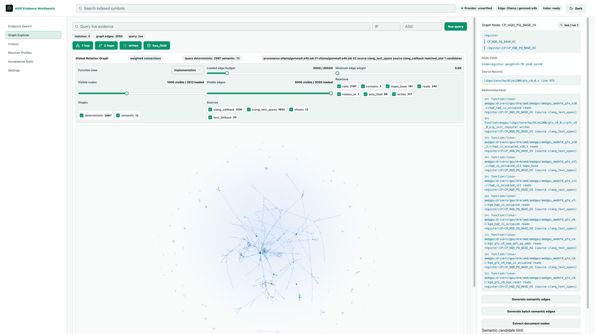

# ASIP Evidence Workbench

ASIP Evidence Workbench is a local-first evidence graph and hybrid retrieval
tool for GPU ASIC engineering. It indexes code, documents, register tables, and
provider-generated semantic edges into a SQLite-backed workbench so engineers
and agents can ask evidence questions, inspect function/register/doc
relationships, and verify graph behavior through CLI, API, and Web surfaces.



Screenshot captured at 2560 x 1440 from the local Web app at
`/graph?dbPath=data%2Fasip.db`.

## What It Does

- Builds a searchable ASIP evidence store from source code, docs, PDFs, and
  register headers.
- Projects product graph nodes as `function`, `register`, and `doc`, while
  keeping wrappers, fields, callbacks, providers, models, and files as
  provenance.
- Separates deterministic graph edges from semantic provider edges so each
  layer can be counted, filtered, and verified independently.
- Supports concept and implementation views for function nodes, including raw
  implementation provenance for normalized concepts.
- Lets resolver profiles own normalization rules instead of hardcoded parser or
  UI behavior.
- Runs with local Ollama models for OpenAI-compatible provider workflows when
  hosted API keys are unavailable.

## Repository Map

| Path | Purpose |
| --- | --- |
| `packages/core/src/asip/` | Python core for indexing, graph projection, retrieval, resolver profiles, providers, and gates. |
| `packages/core/tests/` | Python regression tests for core behavior. |
| `apps/web/` | Next.js workbench UI, Web API route helpers, and Playwright tests. |
| `apps/api/` | FastAPI service for non-Next API usage. |
| `configs/workbench-limits.json` | Central graph, semantic, retrieval, and embedding budgets. |
| `configs/resolvers/*.yaml` | Committed resolver and normalization profiles. |
| `docs/guides/normalization-rules.md` | Human and agent guide for setting normalization rules. |
| `docs/gaps/` | Current acceptance, gap, and release-gate ledger. |
| `docs/qa/` | QA runs, browser evidence, acceptance artifacts, and residual notes. |
| `skills/` | Repo-local agent skills for bootstrap, editing, workbench use, and normalization rules. |

## Quick Start

Install dependencies:

```bash
pnpm install
export PYTHONPATH=packages/core/src:packages/core/tests:.
```

Check the local SQLite workbench database:

```bash
PYTHONPATH=packages/core/src:. python3 -m asip.cli corpora --db data/asip.db
PYTHONPATH=packages/core/src:. python3 -m asip.cli jobs --db data/asip.db
sqlite3 data/asip.db "pragma quick_check;"
```

Start the Web workbench:

```bash
cd apps/web
pnpm dev --hostname 127.0.0.1 --port 3100
```

Open:

```text
http://127.0.0.1:3100/graph?dbPath=data%2Fasip.db
```

Start the FastAPI surface when needed:

```bash
PORT=8000 pnpm dev:api
```

## Local Provider Setup

The active local provider path is Ollama through an OpenAI-compatible `/v1`
surface. A typical local setup uses:

- edge / semantic model: `gemma4:e4b`
- embedding model: `nomic-embed-text:latest`

Keep provider settings explicit in the UI or environment, then verify with the
acceptance and browser checks before treating provider-generated edges as
current evidence.

## Normalization Rules

Concept and register normalization are configurable. Do not add naming
convention special cases directly to Python, TypeScript, or UI labels.

Use:

- committed YAML profiles under `configs/resolvers/*.yaml`
- inline Resolver Profiles in the Web app for experiments
- `docs/guides/normalization-rules.md` for the rule schema and verification
  checklist
- `skills/asip-set-normalization-rules/SKILL.md` when an agent is editing or
  reviewing normalization behavior

For function concepts, Graph Explorer should preserve the raw implementation
list so a clicked concept node can explain which concrete functions generated
it.

## Validation

Focused core checks:

```bash
PYTHONDONTWRITEBYTECODE=1 PYTHONPATH=packages/core/src:packages/core/tests:. \
  python3 -m unittest packages.core.tests.test_resolver_profiles -v

PYTHONDONTWRITEBYTECODE=1 PYTHONPATH=packages/core/src:packages/core/tests:. \
  python3 -m unittest packages.core.tests.test_storage_graph -v
```

Web type check:

```bash
pnpm --filter web exec tsc --noEmit
```

Browser smoke against an already-running local Web server:

```bash
PLAYWRIGHT_SKIP_WEB_SERVER=1 \
PLAYWRIGHT_BASE_URL=http://127.0.0.1:3100 \
pnpm --filter web exec playwright test tests/workbench-smoke.spec.ts --reporter=line
```

Final post-push gate:

```bash
pnpm gate:postpush
```

## Agent Workflow

Agents should start with the root `AGENTS.md`, then use the repo-local skills:

- `skills/asip-bootstrap/SKILL.md` for fresh checkout setup and service start.
- `skills/asip-use-workbench/SKILL.md` for real DB, API, and browser graph QA.
- `skills/asip-edit-code/SKILL.md` for scoped implementation and evidence-safe
  edits.
- `skills/asip-set-normalization-rules/SKILL.md` for resolver-owned graph
  normalization changes.

Before marking work complete, confirm the current DB, current browser surface,
and current acceptance artifacts agree. Historical QA files are useful context,
but they are not proof for a fresh change unless the current tree is rechecked.
